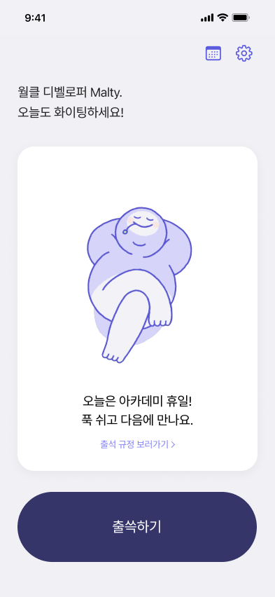
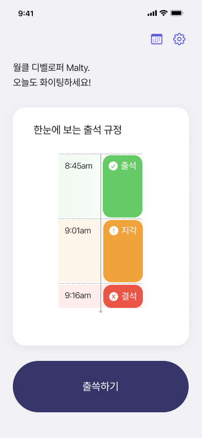
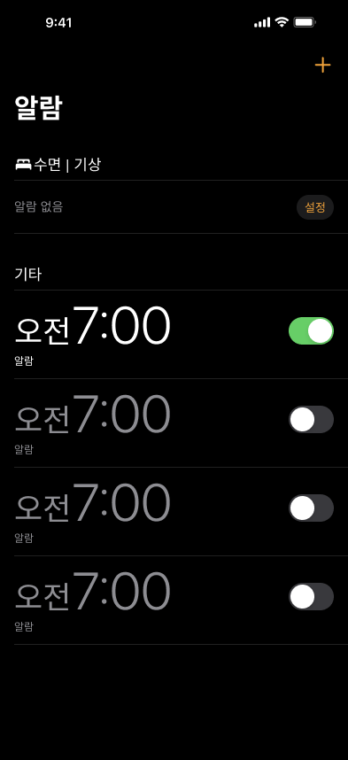
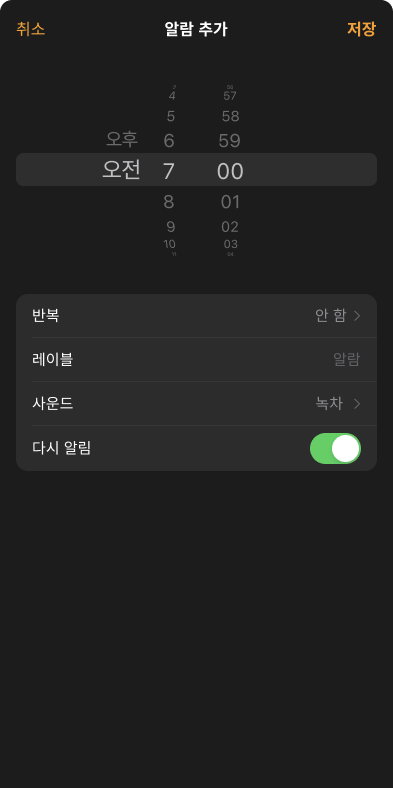
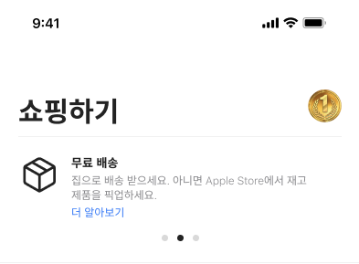
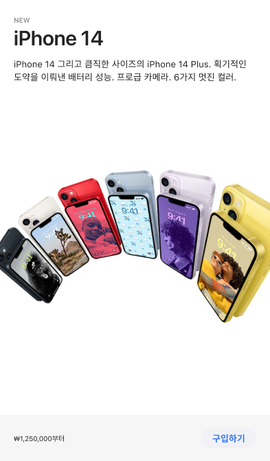
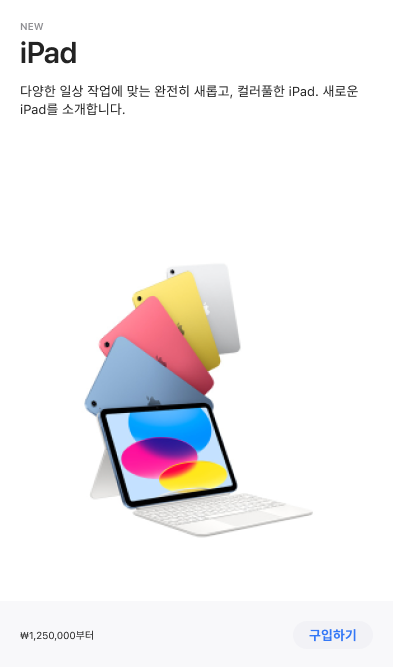
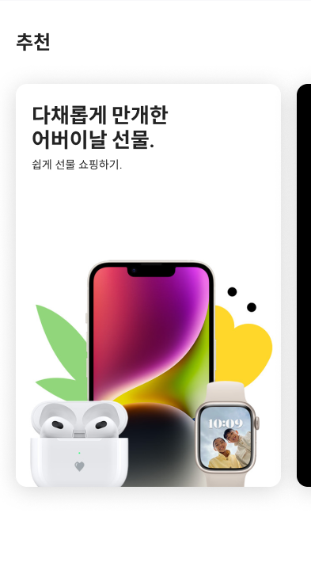

# Rash팬클럽: iOS 클론코딩 & 코드리뷰 & 리팩토링

## 진행 방식

### 구성
- #### 1주차: 클론 코딩
- #### 2주차: 코드 리뷰 & 리팩토링 (구글 코드 리뷰 가이드: https://soojin.ro/review/)

 

### 세부 진행

- #### 1주차 모임 전까지
    1. 성심성의껏 과제
    2. 모르면 팀원들에게 거침없이 물어보고, 열과 성을 다해 도와주기

- #### 1주차 모임
    1. 6명 모두 작업해온 것 설명하기 (핵심 기능 중심으로)
    2. 야무지게 피드백 해주기
    3. 2명씩 랜덤하게 짝꿍 편성
    4. 짝꿍 == 서로의 code review를 성심성의껏 도와주는 존재

- #### 2주차 모임 전까지
    1. [필수] 1주차 스터디 모임 전까지, 각자 작업한 파일 PR **(올릴 때 주석 필수!)**
    2. [필수] 1번을 기준으로 짝꿍끼리 code review 후 merge 승인 **(PR comment로 피드백)**
    3. [필수] 1번을 기준으로 + 2번이 완료되면 참고하여 Refactoring 진행
    4. [필수] Refactoring 마치고 다시 PR
    5. [선택] 4번을 기준으로 짝꿍끼리 code review

- #### 2주차 모임
    1. 랜덤하게 2명 뽑아서 Refactoring 발표
    2. 새로운 과제 부여
 
 
 

## 컨벤션

### 파일 구조
- RashFanClub
  - week03
  - week04
    - readme.md
    - pepe
      - pepe의 프로젝트 파일
    - rash
      - rash의 프로젝트 파일

### 브랜치

#### 가이드
- "{몇 주차}\_{닉네임}\_{브랜치 번호}"

#### 예시
- "week03_pepe_01"
- "week05_malty_18"

### 커밋 메시지

#### 가이드
- "{타입} : #{몇 주차} {내용} - {리뷰어_#Comment번호}"

#### 예시
- "Feat : week04 구현 완료"
- "Feat : week04 ToastView 애니메이션 구현 완료 - 말티_#18"
- "Docs : week04 ToastView에 주석 추가 완료 - 페페_#3"
- "Refactor : week04 MainView 리팩토링 완료"

### PR & Comment

#### Comment 가이드

- 코드 라인 diff를 클릭 or 드래그 해서 Comment 달기
- {Comment 번호}. {코멘트 내용}

#### Comment 예시
- 코드 라인 위치는 옵션; 해당 위치 드래그 해서 comment 달 것이기 때문에.
- 3. (MainView 25~) .background() 연속 선언의 필요성
- 7. Model 명칭 “itemOtherColor”의 변경 필요성
 
좋은 PR: [이안 사례](https://github.com/LeeSungNo-ian/EyeTracking-ARKit/pull/4)
좋은 Comment: [1기 사례](https://github.com/DeveloperAcademy-POSTECH/MC2-Team3-SSAK3/pull/54)

#### Git/GitHub이 헷갈리면?
예시 참고: [페페 블로그](https://soobamba.tistory.com/entry/github-branch-%EB%A7%8C%EB%93%A4%EC%96%B4%EC%84%9C-%EC%8B%A4%EC%A0%84-%ED%98%91%EC%97%85%ED%95%98%EA%B8%B0)

 
 

## 히스토리

### 1주차: [출쓱](https://apps.apple.com/kr/app/%EC%B6%9C%EC%93%B1/id6445873342)

|Page 01|Page 02|
|---|---|
|||

 
 

### 2주차: 애플 스토어

|Page 01|Page 02|
|---|---|
|||

 
 

### 3주차: 알람

|Page 01|Page 02|Page 03|Page 04|
|---|---|---|---|---|
|||||

 
 

## 멋진 팀원들

|[MK](https://github.com/MK827)|[Royce](https://github.com/Jin-s-work)|[Malty](https://github.com/youihyonKim)|[Chad](https://github.com/chad0909)|[PEPE](https://github.com/unboxing96)|[Rash](https://github.com/kdb1217)|
|---|---|---|---|---|---|
|||||||
